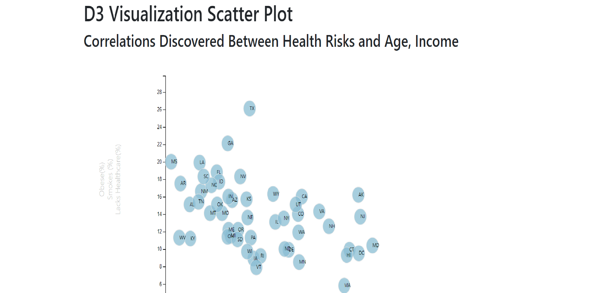

# D3 Visualization Scatter Plot

This Project was creating an interactive scatter plot outlining the health risks with respect to factors like income, obesity, age and smoking habits.

Data set used was  the Census Bureau 2014 ACS 1-year estimates: [https://factfinder.census.gov/faces/nav/jsf/pages/searchresults.xhtmls](https://factfinder.census.gov/faces/nav/jsf/pages/searchresults.xhtml).

Using D3 this is an interactive plot which represents each State with a circle and the initials within it. D3 tips used as well to show individual circle data when hovered on as well as animation transitions for changing axes.

